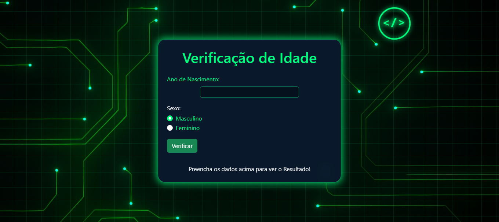

<h2 id="sobre-o-projeto">1. Verificador de Idade - JavaScript 👶👴</h2>


[](https://github.com/Domisnnet/Projeto-Alura/blob/main/LICENSE)



Bem-vindo ao **Verificador de Idade**! Um projeto interativo desenvolvido para calcular a faixa etária de um usuário com base no ano de nascimento e gênero. Com uma interface simples e funcional, o sistema entrega um feedback visual dinâmico, adaptando imagens e mensagens para cada fase da vida.

---

## 📚 Tabela de Conteúdo

| 👶 O Projeto | 🛠️ Técnico | 🤝 Comunidade |
| :---: | :---: | :---: |
| [](#sobre-o-projeto) | [](#destaques-tecnicos) | [](#codigo-fonte) |
| [](#tecnologias-utilizadas) | [](#codigo-fonte) | [](#créditos) |
| [](#como-acessar) | [](#como-contribuir) | [](#licenca) |
| [](#funcionalidades) | [](#faq) | [](#perfil-do-github) |

---

<h2 id="tecnologias-utilizadas">2. ⚙️ Tecnologias Utilizadas</h2>

| Camada | Tecnologias | Descrição |
| :--- | :--- | :--- |
| **Frontend** |   | Estrutura semântica e estilização para interface amigável. |
| **Lógica** |  | Cálculo de idade, validação de dados e troca de imagens. |
| **IA Support** |  | Auxílio na refatoração de código e padronização documental. |

---

<h2 id="como-acessar">3. 🚀 Como Acessar</h2>

Clique no botão abaixo para iniciar o Verificador de Idade diretamente no seu navegador:

<div align="left">
  <a href="https://domisnnet.github.io/Projeto-Alura/" target="_blank">
    
  </a>
</div>

---

<h2 id="funcionalidades">4. 🧩 Funcionalidades Principais</h2>

O projeto foca em simplicidade e feedback instantâneo para o usuário:

| Funcionalidade | Descrição |
| :--- | :--- |
| 🧮 **Cálculo Preciso** | Processamento automático da idade com base no ano atual. |
| 🖼️ **Imagens Dinâmicas** | Exibição de fotos específicas para crianças, jovens, adultos e idosos. |
| ⚧️ **Seleção de Gênero** | Lógica adaptativa para resultados masculinos e femininos. |
| ⚠️ **Validação de Erro** | Tratamento para campos vazios ou anos de nascimento inválidos. |
| 📱 **Design Adaptável** | Interface limpa que permite a verificação em diferentes telas. |

---

<h2 id="destaques-tecnicos">5. 💻 Destaques Técnicos</h2>

Neste projeto, os principais desafios técnicos superados foram:

### 🔄 Manipulação Dinâmica do DOM
Uso intensivo de JavaScript para alterar o conteúdo de `<div>` e atributos `src` de imagens sem a necessidade de recarregar a página, garantindo uma experiência fluida.

### 📐 Condicionais Encadeadas
Implementação de uma estrutura lógica robusta para classificar corretamente a faixa etária e o gênero, garantindo que a imagem correta seja carregada para cada combinação possível.

---

<h2 id="codigo-fonte">6. 🚀 Instalação e Configuração Local</h2>

```bash
# Clonar o repositório
git clone [https://github.com/Domisnnet/Projeto-Alura.git](https://github.com/Domisnnet/Projeto-Alura.git)

# Acessar a pasta
cd Projeto-Alura
```

---

<h2 id="como-contribuir">7. 🤝 Como Contribuir</h2>

Siga os passos abaixo para fortalecer este projeto:

| Fase | Ação | Link / Comando |
| :---: | :--- | :--- |
| **01** | **Fork** | [](https://github.com/Domisnnet/Projeto-Alura/fork) |
| **02** | **Branch** | `git checkout -b feature/MinhaMelhoria` |
| **03** | **Commit** | `git commit -m 'feat: nova seção de álbuns'` |
| **04** | **Push** | `git push origin feature/MinhaMelhoria` |
| **05** | **PR** | [](https://github.com/Domisnnet/Projeto-Alura/compare) |

### 🐛 Encontrou um problema?
Se algo não estiver funcionando como esperado, não hesite em abrir um chamado:

[](https://github.com/Domisnnet/Projeto-Alura/issues)
[](https://github.com/Domisnnet/Projeto-Alura/issues/new)

---

<h2 id="faq">8. 🧠 Perguntas Frequentes</h2>

<details>
<summary><strong>O cálculo considera o mês de nascimento ❓</strong></summary>
<p>📅 <strong>Resposta:</strong> Atualmente o cálculo é baseado apenas na subtração do ano atual pelo ano informado. Uma melhoria futura prevista é a inclusão de meses para maior precisão.</p>
</details>

<details>
<summary><strong>Como as imagens são carregadas ❓</strong></summary>
<p>🖼️ <strong>Resposta:</strong> As imagens são alteradas dinamicamente via JavaScript através do método <code>img.setAttribute('src', 'caminho/da/imagem.png')</code> baseado no resultado da lógica condicional.</p>
</details>

<details>
<summary><strong>O projeto é responsivo para Mobile ❓</strong></summary>
<p>📱 <strong>Resposta:</strong> Sim! Utilizamos CSS moderno para garantir que o container central se ajuste corretamente em telas menores, mantendo a legibilidade do formulário.</p>
</details>

<details>
<summary><strong>Posso usar este código para meus estudos ❓</strong></summary>
<p>🤝 <strong>Resposta:</strong> Com certeza. O projeto é Open Source sob a licença MIT. Sinta-se à vontade para clonar, estudar a lógica e adaptar para suas necessidades.</p>
</details>

---

<h2 id="codigo-fonte">9. 💻 Código Fonte</h2>

Para uma navegação direta pelos arquivos do desenvolvedor:

[](https://github.com/Domisnnet/Projeto-Alura/tree/main/src)

---

<h2 id="créditos">10. 📝 Créditos & Reconhecimentos</h2>

O **Verificador de Idade** é fruto de estudos práticos e colaboração tecnológica:

| Atribuição | Responsável / Recurso | Descrição |
| :--- | :--- | :--- |
| **Arquitetura & Dev** | **DomisDev** | Desenvolvimento da lógica, estrutura HTML e estilização CSS. |
| **Educação** | **Alura** | Base de conhecimento e fundamentos de lógica de programação. |
| **Apoio Técnico** | **Google Gemini** | Auxílio na revisão de código e padronização documental. |
| **Assets Visuais** | **DomisDev** | Seleção e tratamento das imagens ilustrativas do projeto. |

### 🎯 Missão do Projeto
> "Este projeto foi construído para demonstrar como conceitos fundamentais de JavaScript podem criar ferramentas úteis, focando na prática de manipulação de elementos e experiência do usuário."

---

<h2 id="licenca">11. 📄 Licença</h2>

Este projeto está licenciado sob a [](https://github.com/Domisnnet/Projeto-Alura/blob/main/LICENSE)

---

<h2 id="perfil-do-github">12. 👨‍💻 Perfil do GitHub</h2>

<a href="https://github.com/Domisnnet">  
</a>
