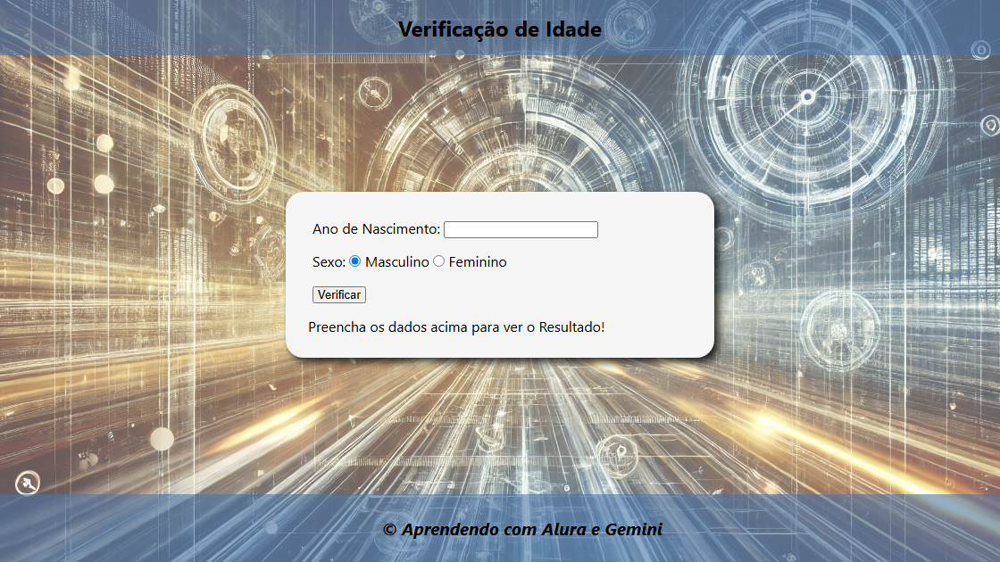

# 👶 Verificador de Idade JavaScript 👴

  

  
  
  

> Um projeto interativo desenvolvido para calcular a idade com base no ano de nascimento e gênero, exibindo resultados personalizados com imagens dinâmicas. Ideal para praticar lógica de programação e manipulação do DOM.

---

## 🚀 Demonstração

Deseja testar a lógica agora mesmo? Acesse o projeto online através do link abaixo:

**[👉 Acessar Verificador de Idade](https://domisnnet.github.io/Projeto-Alura/)**

---

## 💡 Visão Geral

Este projeto foi construído durante a minha jornada de aprendizado na **Alura**, com o suporte estratégico do **Gemini**, para explorar como o JavaScript pode interagir com o usuário em tempo real através da manipulação de formulários e elementos visuais.

### ✨ Funcionalidades
* **Cálculo Instantâneo:** Processamento imediato da idade baseada no ano atual.
* **Feedback Visual Dinâmico:** Troca de imagens conforme a faixa etária detectada.
* **Interface Amigável:** Design limpo e intuitivo para qualquer dispositivo.
* **Acessibilidade:** Uso correto de labels e elementos semânticos.

---

## 🛠️ Tecnologias Utilizadas

| Tecnologia | Função |
| :--- | :--- |
| **HTML5** | Estruturação semântica da interface. |
| **CSS3** | Estilização moderna e responsividade. |
| **JavaScript (ES6+)** | Lógica de cálculo, validação e troca de imagens. |
| **Google Gemini** | Auxílio na refatoração e otimização de código. |

---

## ⚙️ Como Participar da Brincadeira?

O funcionamento é simples e direto:

1.  **Input:** Digite o ano em que você veio ao mundo.
2.  **Gênero:** Selecione a opção Masculino ou Feminino.
3.  **Resultado:** Clique em **Verificar** para ver a revelação da sua idade aparecer com uma imagem ilustrativa correspondente!

---

## 🤝 Contribuições

Este deck é aberto para melhorias! Siga os passos para fortalecer o código:

1.  🍴 **Fork:** Adicione este projeto ao seu perfil.
2.  🌿 **Branch:** Crie uma branch para suas atualizações (`git checkout -b minha-contribuicao`).
3.  ✍️ **Commit:** Guarde suas mudanças com mensagens claras.
4.  🚀 **Push:** Envie para o seu repositório.
5.  ⚔️ **Pull Request:** Abra uma solicitação de mesclagem para análise.

---

## 📝 Licença

Este projeto está licenciado sob a [MIT License](LICENSE).

---

## 🧑‍💻 Autor

Desenvolvido com ❤️ por **DomisDev**.

<a href="https://github.com/Domisnnet">
    
     
    <b>@DomisDev</b>
</a>

---

**Pronto para interagir? Clique, descubra e divirta-se!** ✨👶👴
# 👶 Verificador de Idade JavaScript 👴

Um projeto simples e divertido para calcular a idade de uma pessoa com base no ano de nascimento e sexo. Ideal para iniciantes em JavaScript!

---

## 🚀 Como Usar o Verificador?

1.  **Comece Agora:**
    Clique no botão abaixo para usar o verificador:

---

## 💡 Visão Geral

Este projeto consiste em um verificador de idade interativo construído com HTML, CSS e JavaScript. Ele permite que os usuários insiram seu ano de nascimento e sexo, calcule a idade resultante e exiba uma mensagem personalizada com base na idade. É uma ótima maneira para desenvolvedores iniciantes praticarem suas habilidades e aprenderem os fundamentos do desenvolvimento web.

## 🛠️ Tecnologias Utilizadas

- **HTML:** Estrutura da página.
- **CSS:** Estilo visual da página.
- **JavaScript:** Lógica para cálculo da idade e manipulação da interface.

## ✨ Funcionalidades

- **Interface Amigável:** Design simples e intuitivo.
- **Entrada de Dados:** Formulário para inserir o ano de nascimento e selecionar o sexo.
- **Cálculo Automático:** Idade calculada instantaneamente após a inserção dos dados.
- **Mensagem Personalizada:** Exibe uma mensagem com base na idade calculada.
- **Acessibilidade:** Implementação de labels para todos os campos de formulário para melhor experiência do usuário.

## Verificação de Idade ⚙️

**Prepare-se para desvendar o mistério da sua idade!** 🕵️‍♀️ Este projeto, nascido da minha jornada de aprendizado na Alura e turbinado pela inteligência do Gemini, convida você a uma experiência digital simples, mas cativante.

**Como participar da brincadeira:**

1.  **Insira seu ano de nascimento:** Digite o ano em que você veio ao mundo no campo indicado.
2.  **Escolha seu gênero:** Selecione a opção que melhor te representa: masculino ou feminino.
3.  **Clique em "Verificar":** Aperte o botão mágico e... TCHARAM! ✨ A revelação da sua idade aparecerá como num passe de mágica! E com uma imagem ilustrativa!

**Por que este projeto é especial?**

- **Interatividade:** Uma interface amigável e direta para uma experiência leve e divertida.
- **Aprendizado na prática:** Uma vitrine do meu progresso como desenvolvedor web, combinando os ensinamentos da Alura com o poder do Gemini.
- **Simplicidade com propósito:** Demonstra como conceitos básicos de programação podem criar ferramentas úteis e interessantes.

**Então, o que você está esperando?** 🤔 Descubra sua idade de uma forma inovadora e veja a mágica acontecer!

## 🤝 Contribuições

    

       👐  Siga os passos para fortalecer este deck:
    

    <ul style="list-style-type: none; padding: 0; margin: 0;">
      <li style="margin-bottom: 10px;">
           1. 🍴 <a href="https://github.com/Domisnnet/Projeto-Alura/fork" target="_blank" style="color: #1c7430; text-decoration: underline;">Faça um fork</a>: Adicione este projeto ao seu deck.
      </li>
      <li style="margin-bottom: 10px;">
          2. 🌿 Crie uma branch: Prepare suas atualizações. <a href="https://www.atlassian.com/br/git/tutorials/using-branches" target="_blank" style="color: #1c7430; text-decoration: underline;">Tutorial sobre Branches</a>
      </li>
      <li style="margin-bottom: 10px;">
          3. ✍️ Prepare seus commits: Guarde suas mudanças. <a href="https://www.atlassian.com/br/git/tutorials/saving-changes/git-commit" target="_blank" style="color: #1c7430; text-decoration: underline;">Tutorial sobre Commits</a>
      </li>
     <li style="margin-bottom: 10px;">
          4. 🚀 Envie: Lance sua sugestão (`git push origin minha-contribuicao`).
      </li>
      <li>
           5. ⚔️ <a href="https://github.com/Domisnnet/Projeto-Alura/compare" target="_blank" style="color: #1c7430; text-decoration: underline;">Abra um Pull Request</a>: Desafie este deck original.
      </li>
      <li>
           6. 🐛 <a href="https://github.com/Domisnnet/Projeto-Alura/issues" target="_blank" style="color: #1c7430; text-decoration: underline;">Reportar um problema/Sugestão (Issues)</a>
      </li>
    </ul>

---

## 📝 Licença

Este projeto está licenciado sob a [MIT License](LICENSE).

---

## 🧑‍💻 Para Desenvolvedores

- **Código Limpo:** O código foi escrito com foco na legibilidade e organização.
- **Comentários:** Funções importantes estão documentadas para facilitar a compreensão.
- **Boas Práticas:** O código segue as boas práticas de desenvolvimento web.

### 🚀 Próximos Passos

- **Validação:** Adicionar validação para garantir que os dados inseridos sejam válidos.
- **Precisão:** Aprimorar o cálculo da idade para considerar o dia e o mês de nascimento.
- **Testes:** Implementar testes unitários para garantir a qualidade do código.
- **Responsividade:** Tornar a interface responsiva para dispositivos móveis.

## 📚 Recursos Adicionais (Para Iniciantes)

- [MDN Web Docs](https://developer.mozilla.org/pt-BR/): A melhor fonte de documentação sobre HTML, CSS e JavaScript.
- [FreeCodeCamp](https://www.freecodecamp.org/): Plataforma online com cursos gratuitos de programação.
- [Alura](https://www.alura.com.br/): Plataforma online com cursos de tecnologia (inclui cursos de HTML, CSS e JavaScript).

## 😄 Autor

- **Desenvolvedor:** **DomisDev**
- **Imagens:** Criadas especificamente para este projeto.

---

Feito com ❤️ por:

<a href="https://github.com/Domisnnet">
    
    DomisDev
</a>

---

**Pronto para interagir? - clique, descubra e divirta-se!** ✨👶👴
